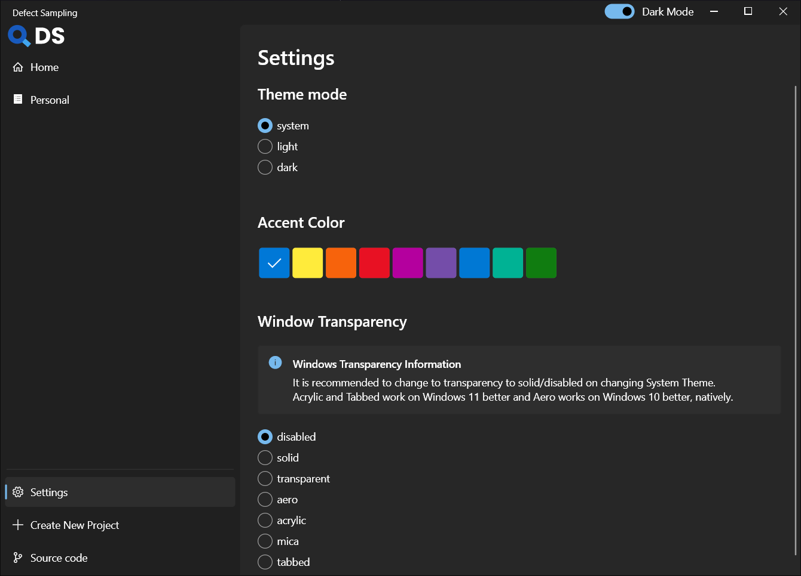
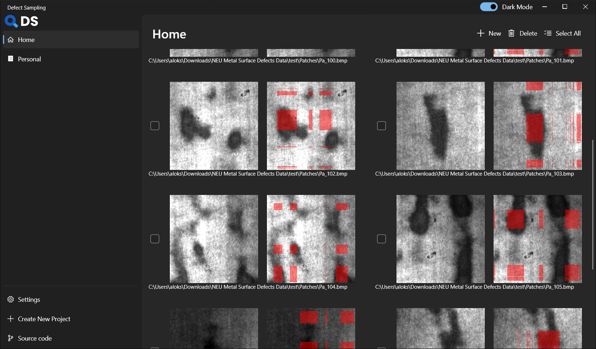
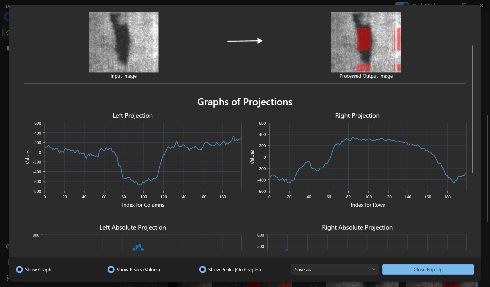

# Defect Sampling (DS)

## Introduction
Defect Sampling (DS) is a university project. 
This project is an attempt to detect the surface defects on a steel strip from it's image.

For now, we are using `Singular Value Decomposition (SVD)` to extract the features from the image.
The *left singular vectors* and *right singluar vector* are used to produce the left and right projections of the image.
The projections are used to determine the potential defects in the image.

## Tools
- **Front End**: The project is made using different open source tools.
The front end of the application is written in [`dart`](https://dart.dev/) language
which used [`flutter`](https://flutter.dev/) framework. The `flutter` compiles the `dart` code
into native `C++` code which make the application fast and light.
- **Back End**: The backend is written in [`.Net C#`](https://learn.microsoft.com/en-us/dotnet/csharp/). 
The backend uses [`LAPACK`](https://netlib.org/lapack/) under the hood for performing matrix
calculation in low level memory. `C#` makes the backend very light and fast.

## Installation

You can download the [`ds_setup`](https://github.com/Tsuzat/DS/releases/download/v0.1/ds_setup.exe) (recommended) or [`ds_portable.zip`](https://github.com/Tsuzat/DS/releases/download/v0.1/ds_portable.zip) (portable zip) file from [releases](https://github.com/Tsuzat/DS/releases).
The bugs are recommended to report on [issues](https://github.com/Tsuzat/DS/issues)
> **Note** Extract the zip file and place the contained files in the desired installation location. (for example, `C:\src\ds_portable`).

>**Warning** Do not extract `ds_portable` to a path that contains special characters or spaces.

>**Warning** Do not extract `ds_portable` in a directory like `C:\Program Files\` that requires elevated privileges.

## Preview

The following images used in preview are taken as screenshots.
The system specification is as mentioned.
- Windows 10
- System Theme (Dark Theme)
- Solid Windows Transparency
- System Accent Color

